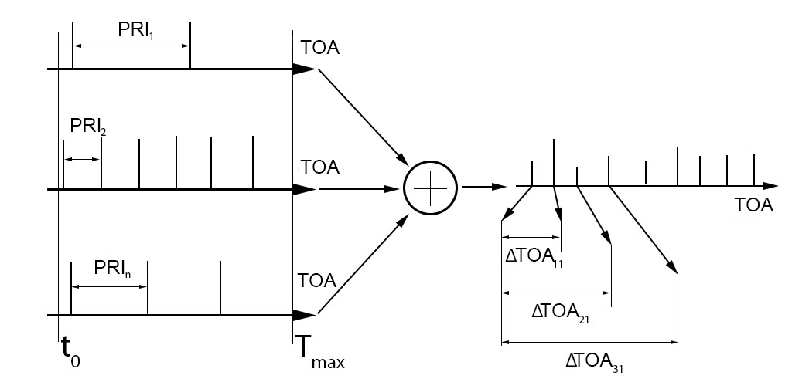
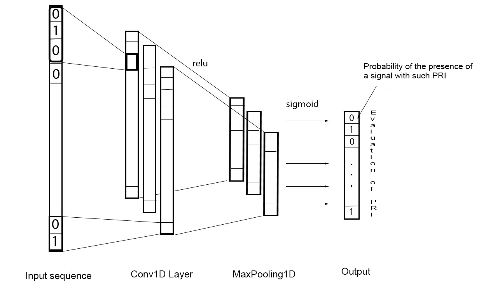
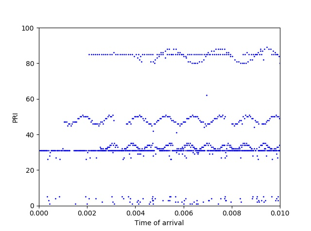
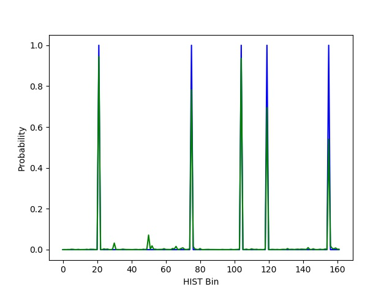

# Deinterleaving-signals-CNN
Test of convolutional neural network for deinterleaving signal with constant and wobulated PRI's. Taken into account the lost and spurious pulses. Input data is the averaged sum of binary signals, outputs is prediction of probability of the presence of a signal with a certain PRI (with definition wobuleted or not wobulated). Accuracy on test set made up 0.986. 

Input mixture signal model (PRI - pulse repetition interval, TOA - time of arrival):

Architecture of neural network:

Some sample of signals shapes:

Output of neural network (blue - true response, green - predicted):

